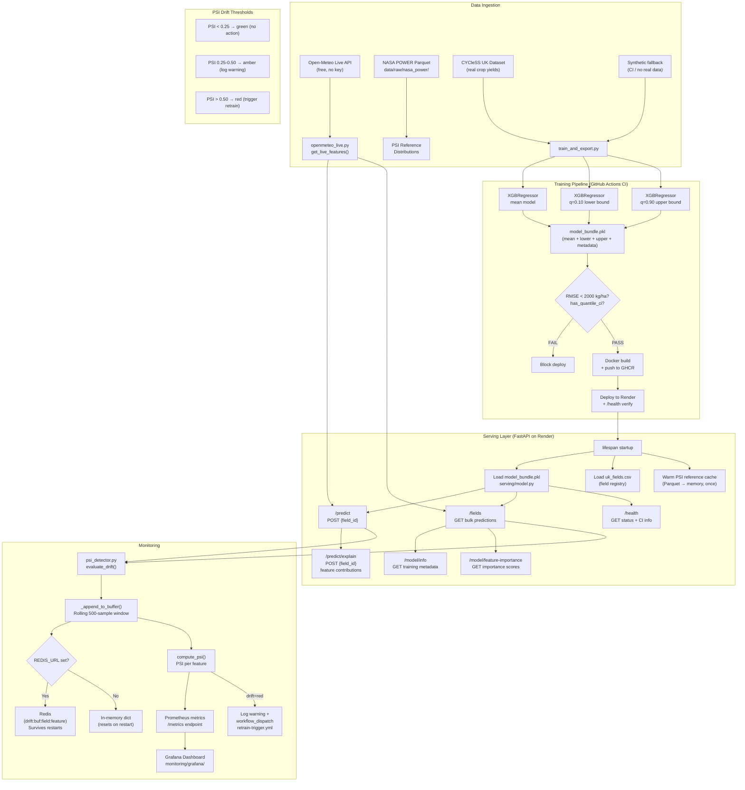

# Agri-Yield System Architecture

End-to-end data flow from ingestion through training, serving, and monitoring.

## Key Design Decisions

| Decision | Rationale |
|---|---|
| Temporal train/test split | Prevents future data leaking into training — correct for time-series crop data |
| Quantile regression CI (q=0.10/0.90) | Statistically honest 80% prediction intervals vs. heuristic ±15% |
| RMSE quality gate in CI | Blocks broken model deployments before they reach production |
| Reference cache warmed at startup | Eliminates per-request Parquet disk reads that caused latency spikes on `/fields` |
| Redis drift buffer with in-memory fallback | Drift history survives container restarts; falls back gracefully if Redis unavailable |
| Semaphore on Open-Meteo calls | Prevents CPU starvation on Render's free 1-CPU instance under bulk load |
| `model_bundle.pkl` (3 models + metadata) | Single artefact contains everything serving needs: mean, lower, upper, importance, RMSE |
| Per-field partial failure in `/fields` | One bad field doesn't crash the entire bulk response — error is isolated per field |

## Endpoints

| Method | Path | Description |
|---|---|---|
| GET | `/health` | Liveness + model status + CI info |
| GET | `/fields` | Bulk predictions for all UK fields (powers the map) |
| POST | `/predict` | Single field prediction with CI bounds + drift status |
| POST | `/predict/explain` | Feature contribution breakdown for a single prediction |
| GET | `/model/info` | Training metadata: RMSE, source, CI method, feature list |
| GET | `/model/feature-importance` | Global feature importance scores |
| GET | `/metrics` | Prometheus metrics scrape endpoint |
