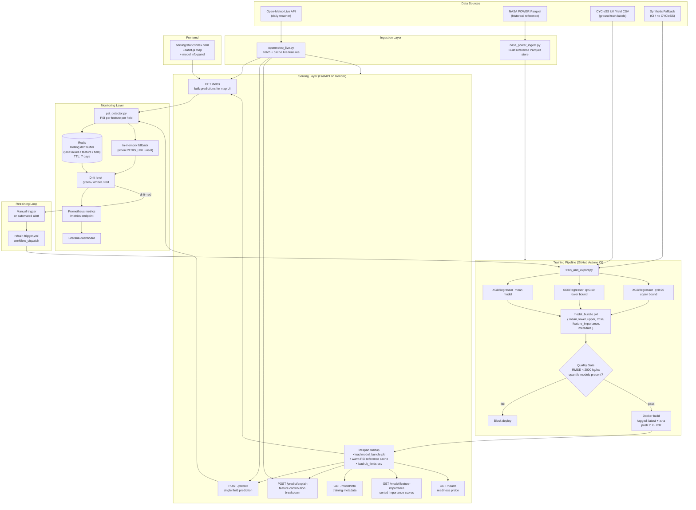

# Agri-Yield System Architecture

This document describes the end-to-end architecture of the agri-yield system:
from raw data ingestion through model training, prediction serving, monitoring,
and automated retraining.

---

## System Diagram

---

## Key Design Decisions

### Three-Model Bundle

A single `model_bundle.pkl` contains three separately trained XGBoost models:

| Model | Objective | Purpose |
|---|---|---|
| `mean` | `reg:squarederror` | Point estimate |
| `lower` | `reg:quantileerror` q=0.10 | Lower CI bound |
| `upper` | `reg:quantileerror` q=0.90 | Upper CI bound |

CI ordering is enforced post-prediction: `lower = min(lower, mean)`, `upper = max(upper, mean)`.
This gives statistically derived 80% prediction intervals rather than a hardcoded ±15% heuristic.

### Startup Reference Cache

All NASA POWER Parquet files are read once at app startup into `_REFERENCE_CACHE` (a dict of
`feature → np.ndarray`). This eliminates per-request Parquet I/O which was a bottleneck on
the Render free tier during high-traffic `/fields` calls.

### Redis Drift Buffer

Per-field, per-feature rolling windows of live values are persisted in Redis (`REDIS_TTL=7d`).
When `REDIS_URL` is unset (local dev, CI), the module falls back transparently to an in-process
dict with no code changes required at the call site.

### Concurrency Control

`asyncio.Semaphore(2)` throttles concurrent Open-Meteo HTTP calls. On Render’s free
1-CPU instance this prevents thread pool exhaustion while still allowing bulk `/fields`
requests to run fields in parallel.

### Quantile CI Fallback Chain

If the bundle contains no quantile models (legacy `model.pkl` path), the system falls back
to `±15%` heuristic bounds and records `"ci_method": "heuristic"` in every response so
callers can distinguish the two cases.

---

## Endpoint Reference

| Method | Path | Purpose |
|---|---|---|
| GET | `/health` | Readiness: model load, fields load, CI status |
| GET | `/fields` | Bulk predictions for all fields (map UI) |
| POST | `/predict` | Single field prediction with drift score |
| POST | `/predict/explain` | Feature contributions for a prediction |
| GET | `/model/info` | Training metadata, RMSE, CI method |
| GET | `/model/feature-importance` | Global feature importance (sorted) |
| GET | `/metrics` | Prometheus scrape endpoint |

---

## Drift Detection Thresholds

| PSI Range | Level | Action |
|---|---|---|
| < 0.25 | green | No action |
| 0.25 – 0.50 | amber | Log warning, Prometheus metric |
| > 0.50 | red | Warning + `drift_warning: true` in response |

Thresholds are wider than the classic 0.10/0.20 because training uses proxy/synthetic
feature values. PSI is only computed once a rolling buffer of `≥30` live requests exists
per field — before that, all fields return `drift_level: green`.
